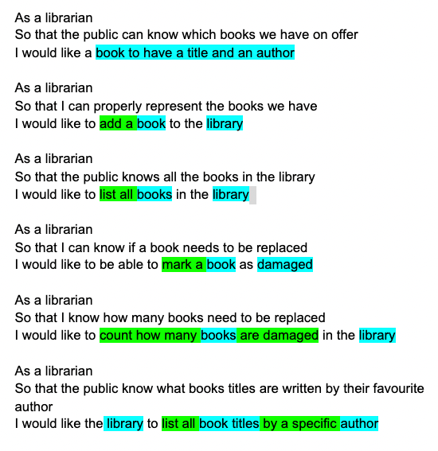
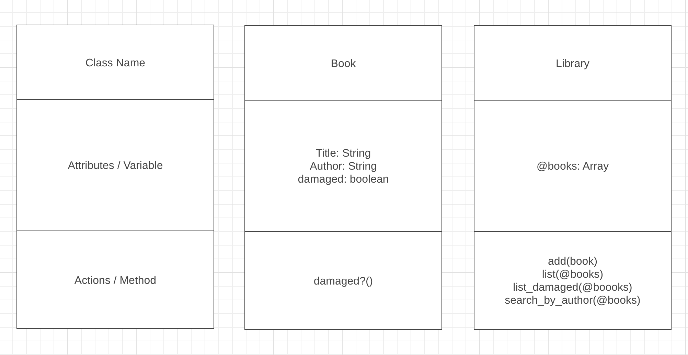

# Domain modelling exercise

Given these user stories:

  

Highlighted in _blue_: all nouns.  

Highlighted in _green_: all actions.  

Given those details:



This domain diagram gives us an idea on how we will structure the code. It might not be exactly what the code looks like in the end. But it's a good starting point.

In the actual code we only changed the name of some methods that make more sense and the arguments passed/or not passed to some methods.

I find it very useful.

_Pair partner for this exercise:_ **Jessica Gordon**

---
Result:

We can initialize a library and books with:
```
Library.new

Book.new("The Neverending Story", "Michael Ende")
```
We can add a book to the library with:
```
london_library = Library.new

my_fave_book = Book.new("The Neverending Story", "Michael Ende")

london_library.add(my_fave_book)
```
If a book is damaged:
```
my_fave_book.is_damaged
```
will change the status of the book to _damaged = true_

To list all the books in the library:
```
london_library.list_books
```
will list all the books (hopefully your library is small 😅) .  

If you want to know how many books in this library are damaged:
```
london_library.count_damaged
```
will return the amount of damaged books.  

If you want to search books by author:
```
london_library.search_by("Michael Ende")
```
will return all _Michael Ende_'s books.